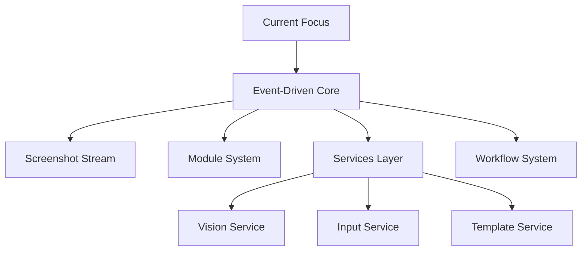

# Active Context: POE Sidekick

## Recent Changes

### Core Infrastructure Completion

1. Screenshot Stream System ✅

   - RxPY integration with Subject/Observable pattern
   - Optimized frame capture with performance monitoring
   - Event distribution system with metrics tracking
   - Memory management and optimization
   - Debug frame capture capabilities
   - Full test coverage

2. Module System Foundation ✅

   - Base module implementation with RxPY integration
   - Robust activation/deactivation control
   - State management patterns
   - Service integration
   - Test module implementation
   - Comprehensive testing framework

3. Service Layer Implementation ✅

   - Vision service with template matching and OCR
   - Input service with safety features
   - Template service for metadata management
   - Configurable behavior and delays
   - Full test coverage

4. Workflow System ✅
   - Async support with proper error handling
   - Sequential module activation with rollback
   - Resource management and cleanup guarantees
   - State tracking and validation
   - Clear extension points for subclasses

### Current Focus

With the core infrastructure now complete, development is focused on implementing the first set of game-specific modules:

#### Module Development Priority

1. Inventory Module (High Priority)

   - State detection system
   - Item management logic
   - Action coordination
   - Integration with workflow system
   - Testing framework setup

2. Stash Module (High Priority)

   - Tab navigation system
   - Item tracking implementation
   - Storage management logic
   - Integration with inventory module
   - Error handling patterns

3. Trade Module (Medium Priority)

   - Trade detection system
   - Item verification logic
   - Trade workflow implementation
   - Integration with other modules
   - Safety feature implementation

4. Loot Module (In Progress)
   - Template system implementation
     - [x] Directory structure for shared templates
     - [x] Template metadata system
       - [x] Service implementation
       - [x] Validation logic
       - [x] Error handling
     - [ ] Ground label detection
     - [ ] Item appearance templates
   - Item filtering system
   - Pickup automation logic
   - Inventory management integration
   - Performance optimization

### Next Steps

1. Implement Ground Label Detection

   - Integrate template service with vision service
   - Implement color-based masking
   - Add template matching logic
   - Create detection tests

2. Implement Inventory Module

   - Design state detection system
   - Develop item management logic
   - Create workflow integration tests
   - Document implementation patterns

3. Documentation Updates

   - Complete API documentation
   - Create user guide
   - Document workflow patterns
   - Update development guidelines

4. Testing Infrastructure
   - Expand testing framework
   - Create module-specific tests
   - Implement integration testing
   - Add performance benchmarks

## Current Development Phase

### Project Status

- **Version:** 0.0.1
- **Stage:** Early Development
- **Phase:** Module Implementation

## Active Focus Areas

### 1. Core Infrastructure

### 2. Priority Development Areas

1. **Template System**

   - Ground label detection
   - Item appearance matching
   - Template validation
   - Performance optimization

2. **Module System**

   - Loot module implementation
   - Module activation control
   - State management patterns
   - Service integration

3. **Workflow System**
   - Workflow orchestration
   - Module coordination
   - Error handling
   - Resource cleanup

## Implementation Priorities

### Immediate Tasks

1. **Core Systems**

   - [x] Implement window detection system
   - [x] Implement screenshot capture
   - [x] Create base module class
   - [x] Set up service interfaces
   - [x] Build workflow system
   - [x] Implement template service

2. **Screenshot Stream Implementation**

   - [x] Set up RxPY event pipeline with Subject
   - [x] Configure continuous frame capture (30 FPS)
   - [x] Implement frame distribution system
   - [x] Add performance monitoring

3. **Initial Modules**

   - [ ] Inventory module
   - [ ] Stash module
   - [ ] Basic trade module
   - [x] Module testing framework

4. **Documentation**
   - [x] Architecture overview
   - [x] Module guidelines
   - [ ] Workflow patterns
   - [ ] Testing approach

## Active Decisions

### Architecture Decisions

1. **Event System**

   - Using RxPY for event stream
   - Screenshot-based state detection
   - Module-specific processing

2. **Module Design**

   - Self-contained modules
   - Independent state tracking
   - Service-based actions

3. **Template System**
   - Centralized template service
   - Metadata-driven configuration
   - Strict validation rules
   - Clear separation of concerns

### Technical Decisions

1. **Technology Choices**

   - Python 3.8+ for core development
   - Poetry for dependency management
   - pytest for testing framework
   - mypy for type checking

2. **Development Workflow**
   - Feature branch workflow
   - PR review process
   - Automated testing requirements
   - Documentation standards

## Current Challenges

### Technical Challenges

1. **Window Management**

   - Window detection reliability
   - Retry mechanisms and timeouts
   - Recovery from window loss

2. **Screenshot Stream Performance**

   - Frame capture rate optimization
   - Memory usage monitoring
   - CPU load balancing
   - Frame buffering strategy

3. **Performance**

   - Screenshot capture rate
   - Frame processing speed
   - Memory management
   - Workflow execution overhead

4. **Module Coordination**

   - Complex workflow orchestration
   - State synchronization
   - Error propagation and recovery
   - Resource cleanup guarantees
   - Module lifecycle management
   - Activation sequence handling

5. **Testing**
   - Screenshot replay testing
   - Module isolation
   - Workflow validation

### Process Challenges

1. **Development**

   - Setting up efficient workflows
   - Maintaining code quality
   - Documentation coverage

2. **Planning**
   - Feature prioritization
   - Resource allocation
   - Timeline management

## Next Steps

### Short-term Goals

1. **Week 1-2**

   - Implement ground label detection
   - Integrate template and vision services
   - Set up detection testing

2. **Week 3-4**
   - Build initial modules
   - Implement workflows
   - Write integration tests

### Medium-term Goals

1. **Month 1-2**

   - Complete core modules
   - Performance optimization
   - Initial release prep

2. **Month 3-4**
   - Additional modules
   - Advanced workflows
   - Beta testing

## Active Considerations

### Technical Considerations

1. **Performance**

   - Resource usage optimization
   - Response time requirements
   - Memory management

2. **Scalability**

   - Plugin system growth
   - Feature additions
   - User base scaling

3. **Maintenance**
   - Code organization
   - Documentation updates
   - Testing coverage

### User Experience Considerations

1. **Installation**

   - Ease of setup
   - Dependency management
   - Configuration process

2. **Usage**

   - Interface design
   - Feature discovery
   - Error handling

3. **Support**
   - Documentation quality
   - Troubleshooting guides
   - Community resources
