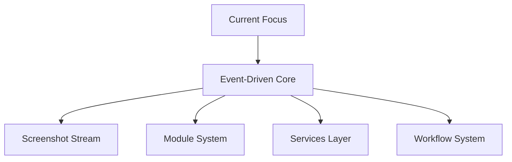

# Active Context: POE Sidekick

## Recent Changes

### Core Architecture Refactoring

1. Added `Engine` class in `core/engine.py`

   - Centralized application lifecycle management
   - Proper async initialization and cleanup
   - Component orchestration (modules, workflows)
   - Error handling and recovery

2. Updated `__main__.py`
   - Migrated to async entry point
   - Added proper signal handling
   - Structured logging setup
   - Clean shutdown process

### Current Focus

Having completed the core Screenshot Stream implementation and Module System foundation, the focus is shifting to specific module implementations:

#### Recently Completed

- Screenshot Stream with RxPY integration
- Performance monitoring and metrics system
- Debug frame capture capabilities
- Memory management and optimization
- Base module implementation with RxPY integration
- Module activation/deactivation control
- State management patterns
- Service integration
- Test module implementation
- Comprehensive module testing framework
- Input Service implementation
  - Mouse control with safety features
  - Configurable delays and bounds
  - Full test coverage

#### Current Priority

- Service Layer Completion:
  - Vision service implementation
    - Modernized type hints
    - Improved code quality
    - Full test coverage
  - Keyboard input integration
  - Service integration testing
- Initial Module Implementations:
  - Inventory module design and implementation
  - Stash module architecture
  - Trade module planning
  - Module integration testing

### Next Steps

1. Design and implement Inventory Module
2. Create Stash Module foundation
3. Plan Trade Module architecture
4. Develop integration tests for module interactions
5. Document module development patterns

## Current Development Phase

### Project Status

- **Version:** 0.0.1
- **Stage:** Early Development
- **Phase:** Core Architecture Implementation

## Active Focus Areas

### 1. Core Infrastructure

### 2. Priority Development Areas

1. **Screenshot Stream**

   - RxPY integration
   - Frame capture optimization
   - Event distribution system
   - Resource management

2. **Module System**

   - Base module implementation
   - Module activation control
   - State management patterns
   - Service integration

3. **Workflow System**
   - Workflow orchestration
   - Module coordination
   - Error handling
   - Resource cleanup

## Implementation Priorities

### Immediate Tasks

1. **Core Systems**

   - [x] Implement window detection system
   - [ ] Implement screenshot capture
   - [ ] Create base module class
   - [ ] Set up service interfaces
   - [ ] Build workflow system

2. **Screenshot Stream Implementation**

   - [x] Set up RxPY event pipeline with Subject
   - [x] Configure continuous frame capture (30 FPS)
   - [x] Implement frame distribution system
   - [ ] Add performance monitoring

3. **Initial Modules**

   - [ ] Inventory module
   - [ ] Stash module
   - [ ] Basic trade module
   - [ ] Module testing framework

4. **Documentation**
   - [x] Architecture overview
   - [x] Module guidelines
   - [ ] Workflow patterns
   - [ ] Testing approach

## Active Decisions

### Architecture Decisions

1. **Event System**

   - Using RxPY for event stream
   - Screenshot-based state detection
   - Module-specific processing

2. **Module Design**

   - Self-contained modules
   - Independent state tracking
   - Service-based actions

3. **Workflow Pattern**
   - Explicit workflow objects
   - Module coordination
   - Clear error boundaries

### Technical Decisions

1. **Technology Choices**

   - Python 3.8+ for core development
   - Poetry for dependency management
   - pytest for testing framework
   - mypy for type checking

2. **Development Workflow**
   - Feature branch workflow
   - PR review process
   - Automated testing requirements
   - Documentation standards

## Current Challenges

### Technical Challenges

1. **Window Management**

   - Window detection reliability
   - Retry mechanisms and timeouts
   - Recovery from window loss

2. **Screenshot Stream Performance**

   - Frame capture rate optimization
   - Memory usage monitoring
   - CPU load balancing
   - Frame buffering strategy

3. **Performance**

   - Screenshot capture rate
   - Frame processing speed
   - Memory management

4. **Coordination**

   - Module interaction patterns
   - Workflow complexity
   - Error propagation

5. **Testing**
   - Screenshot replay testing
   - Module isolation
   - Workflow validation

### Process Challenges

1. **Development**

   - Setting up efficient workflows
   - Maintaining code quality
   - Documentation coverage

2. **Planning**
   - Feature prioritization
   - Resource allocation
   - Timeline management

## Next Steps

### Short-term Goals

1. **Week 1-2**

   - Implement screenshot stream
   - Create base module system
   - Set up core services

2. **Week 3-4**
   - Build initial modules
   - Implement workflows
   - Write integration tests

### Medium-term Goals

1. **Month 1-2**

   - Complete core modules
   - Performance optimization
   - Initial release prep

2. **Month 3-4**
   - Additional modules
   - Advanced workflows
   - Beta testing

## Active Considerations

### Technical Considerations

1. **Performance**

   - Resource usage optimization
   - Response time requirements
   - Memory management

2. **Scalability**

   - Plugin system growth
   - Feature additions
   - User base scaling

3. **Maintenance**
   - Code organization
   - Documentation updates
   - Testing coverage

### User Experience Considerations

1. **Installation**

   - Ease of setup
   - Dependency management
   - Configuration process

2. **Usage**

   - Interface design
   - Feature discovery
   - Error handling

3. **Support**
   - Documentation quality
   - Troubleshooting guides
   - Community resources
