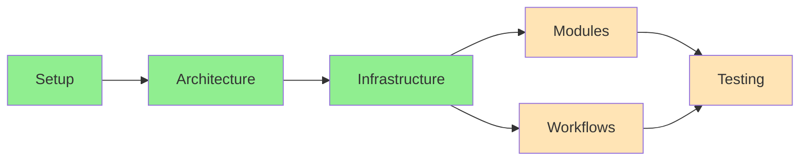

# Progress Tracking: POE Sidekick

## Project Status Overview

### Development Progress

## Completed Features

### Project Setup ✅

- [x] Basic project structure
- [x] Development environment configuration
- [x] Version control setup
- [x] Documentation framework
- [x] Testing framework

### Development Infrastructure ✅

- [x] Poetry configuration
- [x] Pre-commit hooks
- [x] Basic CI/CD pipeline
- [x] Code quality tools

## In Progress Features

### Core Infrastructure ✅

All core infrastructure components have been completed with full test coverage and documentation:

1. **Screenshot Stream** ✅
2. **Module System** ✅
3. **Service Layer** ✅
   - Vision service
   - Input service
   - Template service
4. **Workflow System** ✅

Progress: 100% - COMPLETED

### Module Development 🚧

1. **Inventory Module** (In Progress)

   - [ ] State detection system
   - [ ] Item management logic
   - [ ] Action coordination
   - [ ] Integration with workflow system
   - [ ] Testing framework setup
   - Progress: 10% - STARTED

2. **Stash Module** (Planning)

   - [ ] Tab navigation system
   - [ ] Item tracking implementation
   - [ ] Storage management logic
   - [ ] Integration with inventory module
   - [ ] Error handling patterns
   - Progress: 5% - PLANNING

3. **Trade Module** (Not Started)

   - [ ] Trade detection system
   - [ ] Item verification logic
   - [ ] Trade workflow implementation
   - [ ] Integration with other modules
   - [ ] Safety feature implementation
   - Progress: 0% - NOT STARTED

4. **Loot Module** (In Progress)
   - Template System
     - [x] Directory structure setup
     - [x] Template metadata system
       - [x] Metadata schema definition
       - [x] Template validation
       - [x] Service implementation
     - [ ] Ground label detection
     - [ ] Item appearance detection
   - [ ] Item filtering system
   - [ ] Pickup automation logic
   - [ ] Inventory management integration
   - [ ] Performance optimization
   - Progress: 15% - IN PROGRESS

### Documentation 🚧

- [x] Project overview
- [x] Development setup
- [x] Core system documentation
- [ ] API documentation
- [ ] User guide
- [ ] Workflow patterns guide
- Progress: 50%

## Pending Features

### Core Modules

1. **Inventory Module**

   - [ ] State detection
   - [ ] Item management
   - [ ] Action coordination
   - Priority: High

2. **Stash Module**

   - [ ] Tab navigation
   - [ ] Item tracking
   - [ ] Storage management
   - Priority: High

3. **Trade Module**

   - [ ] Trade detection
   - [ ] Item verification
   - [ ] Trade workflow
   - Priority: Medium

4. **Loot Module**
   - [ ] Item filtering
   - [ ] Pickup automation
   - [ ] Inventory management
   - Priority: Medium

### Workflows

1. **Trade Workflow**

   - [ ] Module coordination
   - [ ] State management
   - [ ] Error handling
   - Priority: High

2. **Crafting Workflow**
   - [ ] Resource management
   - [ ] Process automation
   - [ ] Result verification
   - Priority: Medium

## Known Issues

### Technical Issues

1. **Screenshot Stream** ✅

   - ~~Performance optimization needed~~ - Implemented with metrics tracking
   - ~~Memory usage concerns~~ - Resolved with monitoring and thresholds
   - ~~Frame rate requirements~~ - Configurable FPS with performance tracking

2. **Module System**
   - State management complexity
   - Service integration patterns
   - Testing methodology

### Process Issues

1. **Development Flow**
   - Module testing strategy
   - Workflow validation
   - Integration testing

## Blockers

### Current Blockers

1. **Technical**

   - Screenshot capture method
   - Performance optimization
   - Module coordination patterns

2. **Process**
   - Testing methodology
   - Integration patterns
   - Module guidelines

## Success Metrics

### Code Quality

- Current test coverage: ~45%
- Target test coverage: 90%
- Documentation coverage: 55%
- Code quality score: Very Good

### Performance

- Response time: TBD
- CPU usage: TBD
- Memory usage: TBD
- Success rate: TBD

## Next Milestones

### Milestone 1: Core Infrastructure ✅

- Target Date: Completed March 2025
- Progress: 100%
- Dependencies: None
- Status: COMPLETED
- Key Achievements:
  - Screenshot Stream completed
  - Module System completed
  - Workflow System completed
  - Service Layer completed

### Milestone 2: Basic Features

- Target Date: May 2025
- Progress: 8%
- Dependencies: Milestone 1 ✅
- Status: In Progress
- Goals:
  - Complete Inventory Module (April 2025)
  - Complete Stash Module (April 2025)
  - Complete Trade Module (May 2025)
  - Complete Loot Module (May 2025)

### Milestone 3: Plugin System

- Target Date: July 2025
- Progress: 0%
- Dependencies: Milestone 1 ✅, Milestone 2
- Status: Planning
- Goals:
  - Plugin Architecture Design (June 2025)
  - Plugin SDK Development (June 2025)
  - Example Plugin Creation (July 2025)
  - Documentation and Guidelines (July 2025)

## Risk Assessment

### Technical Risks

1. **Performance**

   - Impact: High
   - Probability: Medium
   - Mitigation: Early optimization

2. **Compatibility**
   - Impact: Medium
   - Probability: Low
   - Mitigation: Extensive testing

### Project Risks

1. **Timeline**

   - Impact: Medium
   - Probability: Medium
   - Mitigation: Agile approach

2. **Resource**
   - Impact: Medium
   - Probability: Low
   - Mitigation: Clear prioritization

## Future Considerations

### Short-term

1. **Technical**

   - Performance optimization
   - Test coverage improvement
   - Documentation expansion

2. **Process**
   - Workflow refinement
   - Quality metrics establishment
   - Review process implementation

### Long-term

1. **Features**

   - Advanced automation
   - Machine learning integration
   - Community plugins support

2. **Community**
   - Plugin marketplace
   - User documentation
   - Support system
