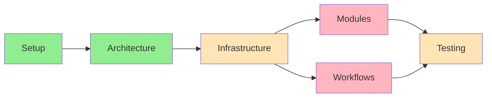

# Progress Tracking: POE Sidekick

## Project Status Overview

### Development Progress

## Completed Features

### Project Setup ✅

- [x] Basic project structure
- [x] Development environment configuration
- [x] Version control setup
- [x] Documentation framework
- [x] Testing framework

### Development Infrastructure ✅

- [x] Poetry configuration
- [x] Pre-commit hooks
- [x] Basic CI/CD pipeline
- [x] Code quality tools

## In Progress Features

### Core Infrastructure 🚧

1. **Screenshot Stream** ✅

   - [x] Game window detection
   - [x] RxPY integration and Subject/Observable pattern
   - [x] Frame capture system with performance monitoring
   - [x] Event distribution with metrics tracking
   - [x] Memory management and optimization
   - [x] Debug frame capture system
   - [x] Comprehensive test coverage
   - Progress: 100% - COMPLETED

2. **Module System**

   - [x] Base module class implementation
   - [x] Activation/deactivation control
   - [x] State management with RxPY integration
   - [x] Test module implementation
   - [x] Unit test coverage
   - Progress: 100% - COMPLETED

3. **Service Layer**

   - [ ] Vision service
   - [ ] Keyboard service
   - [ ] Mouse service
   - Progress: 0%

4. **Workflow System**
   - [ ] Base workflow class
   - [ ] Module coordination
   - [ ] Error handling
   - Progress: 0%

### Documentation 🚧

- [x] Project overview
- [x] Development setup
- [ ] API documentation
- [ ] User guide
- Progress: 40%

## Pending Features

### Core Modules

1. **Inventory Module**

   - [ ] State detection
   - [ ] Item management
   - [ ] Action coordination
   - Priority: High

2. **Stash Module**

   - [ ] Tab navigation
   - [ ] Item tracking
   - [ ] Storage management
   - Priority: High

3. **Trade Module**

   - [ ] Trade detection
   - [ ] Item verification
   - [ ] Trade workflow
   - Priority: Medium

4. **Loot Module**
   - [ ] Item filtering
   - [ ] Pickup automation
   - [ ] Inventory management
   - Priority: Medium

### Workflows

1. **Trade Workflow**

   - [ ] Module coordination
   - [ ] State management
   - [ ] Error handling
   - Priority: High

2. **Crafting Workflow**
   - [ ] Resource management
   - [ ] Process automation
   - [ ] Result verification
   - Priority: Medium

## Known Issues

### Technical Issues

1. **Screenshot Stream** ✅

   - ~~Performance optimization needed~~ - Implemented with metrics tracking
   - ~~Memory usage concerns~~ - Resolved with monitoring and thresholds
   - ~~Frame rate requirements~~ - Configurable FPS with performance tracking

2. **Module System**
   - State management complexity
   - Service integration patterns
   - Testing methodology

### Process Issues

1. **Development Flow**
   - Module testing strategy
   - Workflow validation
   - Integration testing

## Blockers

### Current Blockers

1. **Technical**

   - Screenshot capture method
   - Performance optimization
   - Module coordination patterns

2. **Process**
   - Testing methodology
   - Integration patterns
   - Module guidelines

## Success Metrics

### Code Quality

- Current test coverage: ~35%
- Target test coverage: 90%
- Documentation coverage: 45%
- Code quality score: Good

### Performance

- Response time: TBD
- CPU usage: TBD
- Memory usage: TBD
- Success rate: TBD

## Next Milestones

### Milestone 1: Core Infrastructure

- Target Date: TBD
- Progress: 25%
- Dependencies: None
- Status: In Progress

### Milestone 2: Basic Features

- Target Date: TBD
- Progress: 0%
- Dependencies: Milestone 1
- Status: Pending

### Milestone 3: Plugin System

- Target Date: TBD
- Progress: 0%
- Dependencies: Milestone 1, 2
- Status: Pending

## Risk Assessment

### Technical Risks

1. **Performance**

   - Impact: High
   - Probability: Medium
   - Mitigation: Early optimization

2. **Compatibility**
   - Impact: Medium
   - Probability: Low
   - Mitigation: Extensive testing

### Project Risks

1. **Timeline**

   - Impact: Medium
   - Probability: Medium
   - Mitigation: Agile approach

2. **Resource**
   - Impact: Medium
   - Probability: Low
   - Mitigation: Clear prioritization

## Future Considerations

### Short-term

1. **Technical**

   - Performance optimization
   - Test coverage improvement
   - Documentation expansion

2. **Process**
   - Workflow refinement
   - Quality metrics establishment
   - Review process implementation

### Long-term

1. **Features**

   - Advanced automation
   - Machine learning integration
   - Community plugins support

2. **Community**
   - Plugin marketplace
   - User documentation
   - Support system
