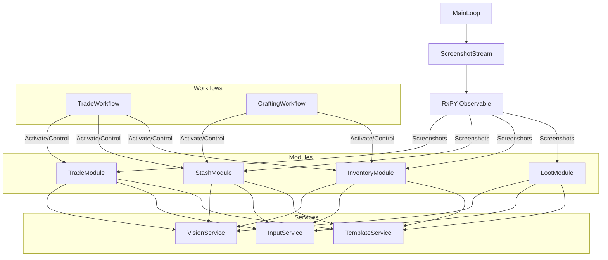

# System Patterns: POE Sidekick

## Core Architecture

### Event-Driven Screenshot Stream



### Core Components

1. **Engine**

   - Application lifecycle management
   - Component initialization and cleanup
   - Error handling and recovery
   - Core system orchestration

2. **Screenshot Stream**

   - Continuous game state capture using RxPY
   - Frame distribution to active modules
   - Efficient resource management
   - Configurable capture rate

3. **Modules**

   - Self-contained functionality units
   - Independent state tracking
   - Autonomous decision making
   - Activation/deactivation control
   - Examples: Inventory, Stash, Trade, Loot

4. **Services**

   - Shared utility functions
   - Hardware interaction layer
   - Vision processing tools
   - Common functionality abstraction
   - Template management and validation

5. **Workflows**
   - Complex operation orchestration
   - Module coordination
   - State management
   - Error handling and recovery

## Design Patterns

### Core Patterns

1. **Event Stream Pattern**

   - RxPY Observable for screenshot distribution
   - Reactive processing model
   - Event filtering and transformation
   - Error handling and retries

2. **Module Pattern**

   - Self-contained business logic
   - Internal state management
   - Service dependency injection
   - Clear activation boundaries

3. **Service Pattern**

   - Shared functionality abstraction
   - Hardware interaction encapsulation
   - Stateless operations
   - Error handling and logging

4. **Workflow Pattern**
   - Module orchestration
   - State coordination
   - Error recovery
   - Sequential operation management

## Implementation Guidelines

### Module Implementation

```python
class BaseModule:
    def __init__(self, services):
        self.active = False
        self.services = services

    def process_frame(self, frame):
        if not self.active:
            return

        self.analyze_frame(frame)

    def activate(self):
        self.active = True

    def deactivate(self):
        self.active = False

class InventoryModule(BaseModule):
    def analyze_frame(self, frame):
        # Module-specific analysis and actions
        pass
```

### Workflow Implementation

```python
class BaseWorkflow:
    def __init__(self, modules: Sequence[BaseModule]) -> None:
        self.modules = list(modules)
        self.active = False
        self._failed_activations: list[BaseModule] = []

    async def activate_modules(self) -> None:
        """Activate all modules with rollback on failure."""
        try:
            for module in self.modules:
                if not module.active:
                    await module.activate()
                    self._failed_activations.append(module)
            self.active = True
            self._failed_activations = []
        except Exception as e:
            await self._cleanup_failed_activation()
            raise ModuleActivationError(e)

    async def deactivate_modules(self) -> None:
        """Deactivate all modules with error collection."""
        errors: list[Exception] = []
        for module in self.modules:
            if module.active:
                try:
                    await module.deactivate()
                except Exception as e:
                    errors.append(e)
        self.active = False
        if errors:
            raise WorkflowError(errors)

class TradeWorkflow(BaseWorkflow):
    def __init__(self, trade_module, stash_module, inventory_module):
        super().__init__([trade_module, stash_module, inventory_module])

    async def execute(self):
        await self.activate_modules()
        try:
            # Workflow steps
            pass
        finally:
            await self.deactivate_modules()
```

## Code Organization

### Project Structure

```
poe_sidekick/
├── core/
│   ├── engine.py      # Core engine
│   ├── stream.py      # Screenshot stream
│   ├── window.py      # Game window
│   └── workflow.py    # Workflow base
├── modules/
│   ├── base.py         # Base module
│   ├── inventory.py    # Inventory module
│   ├── stash.py        # Stash module
│   └── trade.py        # Trade module
├── services/
│   ├── vision.py       # Vision service
│   └── input.py        # Input service (mouse & keyboard)
├── workflows/
│   ├── trade.py        # Trade workflow
│   └── craft.py        # Craft workflow
└── data/
    └── templates/      # Shared template system
        ├── ground_labels/    # Item labels on ground
        │   ├── currency/     # Currency labels
        │   ├── unique/       # Unique item labels
        │   └── rare/         # Rare item labels
        └── item_appearances/ # Items in inventory/stash
            ├── currency/     # Currency appearances
            ├── unique/       # Unique item appearances
            └── rare/         # Rare item appearances
```

### Template System Pattern

1. **Template Organization**

   - Shared template repository for all modules
   - Separation between ground labels and inventory appearances
   - Categorized by item type and rarity
   - Metadata-driven configuration in metadata.json

2. **Detection Strategy**

   - Ground items: Color-based masking + template matching
   - Inventory items: Direct template matching in grid positions
   - Configurable detection thresholds
   - HSV color range definitions for ground items

3. **Template Service**

   - Centralized template metadata management
   - Template validation and error handling
   - Lazy loading of templates
   - Shared access across modules
   - Clear separation from vision processing

4. **Template Structure**
   - Version controlled templates
   - Category-based organization
   - Standardized metadata format
   - Configurable detection parameters
   - Grid size specifications for inventory items

## Best Practices

### 1. Module Development

- Keep modules focused and independent
- Handle module-specific state internally
- Use services for shared functionality
- Clear activation/deactivation boundaries
- Implement proper error handling and recovery
- Ensure resource cleanup in all cases
- Use type hints for better maintainability
- Document public APIs thoroughly

### 2. Workflow Development

- Inherit from BaseWorkflow for consistent behavior
- Implement proper error handling with rollback
- Ensure sequential module activation
- Guarantee resource cleanup in all cases
- Handle activation failures gracefully
- Collect and propagate errors appropriately
- Document workflow steps and requirements
- Test error scenarios thoroughly

### 3. Service Development

- Stateless operations
- Clear error handling
- Hardware abstraction
- Resource management

### 4. Testing Strategy

- Unit tests for modules with high coverage
- Integration tests for workflow coordination
- Error scenario testing with mocked failures
- Resource cleanup verification
- Service mocking and dependency injection
- Screenshot replay testing for visual components
- Performance benchmarking for critical paths
- State transition testing

## Anti-Patterns to Avoid

1. **Cross-Module Dependencies**

   - Modules should not directly reference each other
   - Use workflows for coordination
   - Maintain module independence

2. **Global State**

   - Keep state within modules
   - Use services for shared functionality
   - Pass necessary data explicitly

3. **Direct Hardware Access**

   - Always use service abstractions
   - Handle hardware errors gracefully
   - Resource cleanup

4. **Blocking Operations**
   - Use async/await for long operations
   - Handle timeouts
   - Non-blocking screenshot processing
