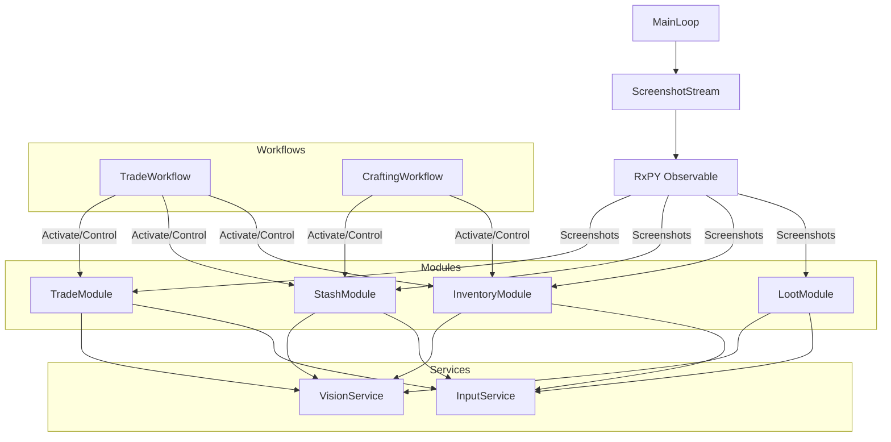

# System Patterns: POE Sidekick

## Core Architecture

### Event-Driven Screenshot Stream



### Core Components

1. **Engine**

   - Application lifecycle management
   - Component initialization and cleanup
   - Error handling and recovery
   - Core system orchestration

2. **Screenshot Stream**

   - Continuous game state capture using RxPY
   - Frame distribution to active modules
   - Efficient resource management
   - Configurable capture rate

3. **Modules**

   - Self-contained functionality units
   - Independent state tracking
   - Autonomous decision making
   - Activation/deactivation control
   - Examples: Inventory, Stash, Trade, Loot

4. **Services**

   - Shared utility functions
   - Hardware interaction layer
   - Vision processing tools
   - Common functionality abstraction

5. **Workflows**
   - Complex operation orchestration
   - Module coordination
   - State management
   - Error handling and recovery

## Design Patterns

### Core Patterns

1. **Event Stream Pattern**

   - RxPY Observable for screenshot distribution
   - Reactive processing model
   - Event filtering and transformation
   - Error handling and retries

2. **Module Pattern**

   - Self-contained business logic
   - Internal state management
   - Service dependency injection
   - Clear activation boundaries

3. **Service Pattern**

   - Shared functionality abstraction
   - Hardware interaction encapsulation
   - Stateless operations
   - Error handling and logging

4. **Workflow Pattern**
   - Module orchestration
   - State coordination
   - Error recovery
   - Sequential operation management

## Implementation Guidelines

### Module Implementation

```python
class BaseModule:
    def __init__(self, services):
        self.active = False
        self.services = services

    def process_frame(self, frame):
        if not self.active:
            return

        self.analyze_frame(frame)

    def activate(self):
        self.active = True

    def deactivate(self):
        self.active = False

class InventoryModule(BaseModule):
    def analyze_frame(self, frame):
        # Module-specific analysis and actions
        pass
```

### Workflow Implementation

```python
class TradeWorkflow:
    def __init__(self, trade_module, stash_module, inventory_module):
        self.trade = trade_module
        self.stash = stash_module
        self.inventory = inventory_module

    async def execute(self):
        try:
            await self.trade.activate()
            await self.stash.activate()
            await self.inventory.activate()

            # Workflow steps

        finally:
            self.trade.deactivate()
            self.stash.deactivate()
            self.inventory.deactivate()
```

## Code Organization

### Project Structure

```
poe_sidekick/
├── core/
│   ├── engine.py      # Core engine
│   ├── stream.py      # Screenshot stream
│   ├── window.py      # Game window
│   └── workflow.py    # Workflow base
├── modules/
│   ├── base.py         # Base module
│   ├── inventory.py    # Inventory module
│   ├── stash.py        # Stash module
│   └── trade.py        # Trade module
├── services/
│   ├── vision.py       # Vision service
│   └── input.py        # Input service (mouse & keyboard)
└── workflows/
    ├── trade.py        # Trade workflow
    └── craft.py        # Craft workflow
```

## Best Practices

### 1. Module Development

- Keep modules focused and independent
- Handle module-specific state internally
- Use services for shared functionality
- Clear activation/deactivation boundaries

### 2. Workflow Development

- Clear error handling and recovery
- Proper module coordination
- Resource cleanup in all cases
- Sequential operation management

### 3. Service Development

- Stateless operations
- Clear error handling
- Hardware abstraction
- Resource management

### 4. Testing Strategy

- Unit tests for modules
- Integration tests for workflows
- Service mocking
- Screenshot replay testing

## Anti-Patterns to Avoid

1. **Cross-Module Dependencies**

   - Modules should not directly reference each other
   - Use workflows for coordination
   - Maintain module independence

2. **Global State**

   - Keep state within modules
   - Use services for shared functionality
   - Pass necessary data explicitly

3. **Direct Hardware Access**

   - Always use service abstractions
   - Handle hardware errors gracefully
   - Resource cleanup

4. **Blocking Operations**
   - Use async/await for long operations
   - Handle timeouts
   - Non-blocking screenshot processing
