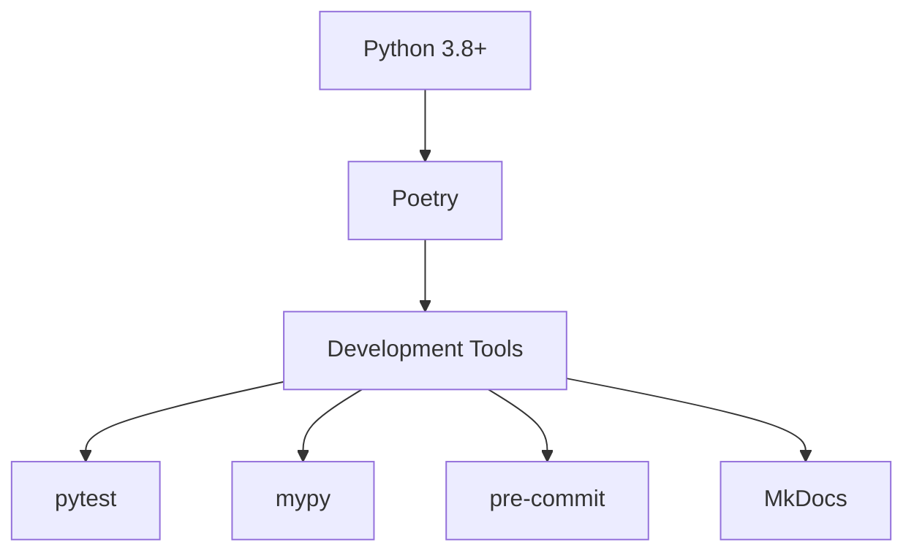

# Technical Context: POE Sidekick

## Technology Stack

### Core Technologies

- Python 3.8+
- Poetry (dependency management)
- pytest (testing framework)
- mypy (static type checking)
- pre-commit (git hooks)
- MkDocs (documentation)

### Development Environment



## Project Structure

### Directory Organization

```
poe_sidekick/
├── core/           # Core functionality and business logic
├── interfaces/     # User interface implementations
│   ├── cli/       # Command-line interface
│   └── gui/       # Graphical user interface
├── plugins/        # Plugin system and implementations
│   └── loot_manager/
├── services/       # Service layer implementations
└── __init__.py    # Package initialization

scripts/           # Development and utility scripts
tests/             # Test suite
docs/              # Documentation
```

## Development Tools

### Build and Dependency Management

- **Poetry**
  - Dependency resolution
  - Virtual environment management
  - Build and packaging
  - Version management

### Code Quality Tools

1. **pre-commit Hooks**

   - Black (code formatting)
   - isort (import sorting)
   - flake8 (linting)
   - mypy (type checking)

2. **Testing Framework**

   - pytest
   - pytest-cov (coverage)
   - pytest-mock (mocking)
   - tox (test automation)

3. **Documentation**
   - MkDocs
   - mkdocstrings
   - markdown extensions

## Development Standards

### Code Style

1. **Formatting**

   - Follow PEP 8
   - Use Black formatter
   - 4 spaces indentation
   - 88 characters line length

2. **Naming Conventions**

   - snake_case for functions and variables
   - PascalCase for classes
   - UPPERCASE for constants
   - \_private prefix for internal use

3. **Documentation**
   - Docstrings for all public APIs
   - Type hints for all functions
   - README files for all packages
   - Inline comments for complex logic

### Testing Requirements

1. **Unit Tests**

   - Required for all new features
   - Minimum 90% coverage
   - Mock external dependencies
   - Fast execution

2. **Integration Tests**

   - Test component interactions
   - Cover main workflows
   - Include error cases
   - Test configuration variations

3. **Performance Tests**
   - Response time benchmarks
   - Resource usage monitoring
   - Scaling characteristics
   - Memory leak detection

## Development Workflow

### Version Control

1. **Git Practices**

   - Feature branches
   - Pull request workflow
   - Semantic versioning
   - Conventional commits

2. **Branch Strategy**
   - main (stable)
   - develop (integration)
   - feature/\* (features)
   - fix/\* (bugfixes)

### CI/CD Pipeline


## Dependencies

### Core Dependencies

- Python standard library
- Computer vision libraries
- GUI frameworks (TBD)
- Testing frameworks

### Development Dependencies

- Black
- isort
- flake8
- mypy
- pytest
- tox
- pre-commit
- MkDocs

## Environment Setup

### Local Development

1. **Prerequisites**

   ```bash
   python 3.8+
   poetry
   git
   ```

2. **Installation**

   ```bash
   make install
   ```

3. **Development Commands**
   ```bash
   make test         # Run tests
   make lint         # Run linting
   make type-check   # Run type checking
   make docs         # Build documentation
   ```

## Performance Requirements

### Runtime Performance

- Sub-second response time
- Minimal CPU usage
- Efficient memory management
- Low latency operations

### Resource Constraints

- Memory: < 500MB
- CPU: < 10% average
- Disk: < 1GB
- Network: Minimal usage
